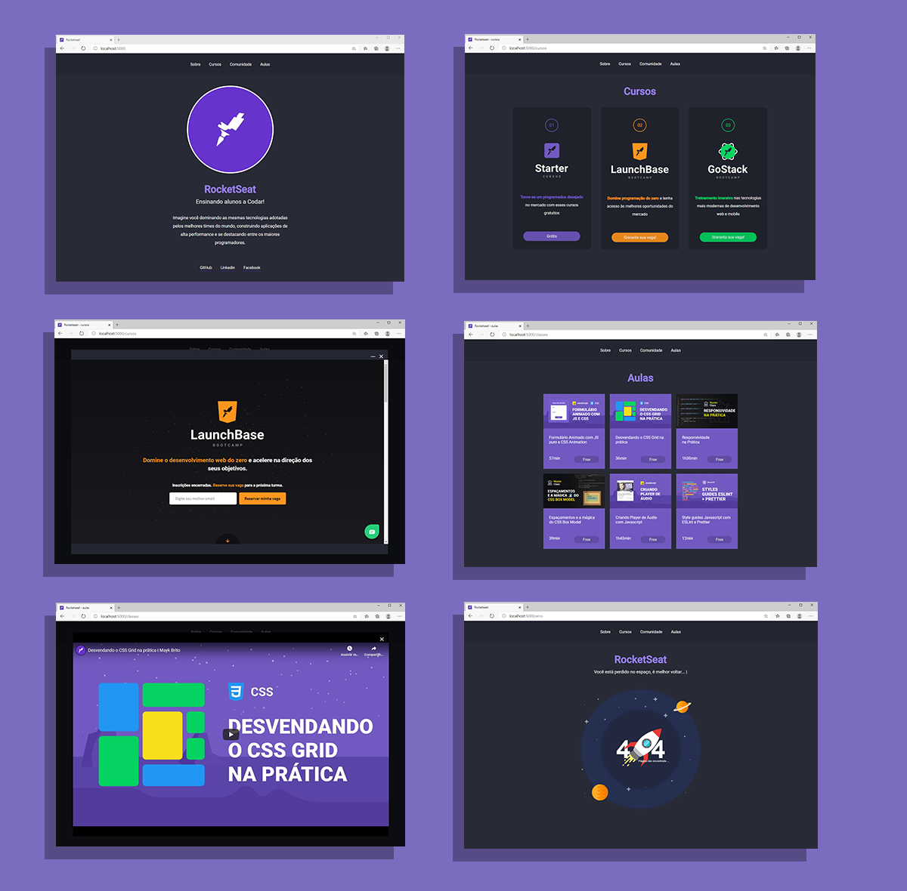

# Site Rocktseat

O site Rocktseat é um projeto do bootcamp Launch Base da **[RocketSeat](https://rocketseat.com.br/)**, cujo objetivo é desenvolver um site que apresente a empresa, seus cursos e alguns vídeos tutoriais do seu canal do YouTube conforme o design apresentado. 

 <h1 align = center>
    
</h1>

## 📚 Páginas
O site é composto por 4 diferentes páginas: 
  - **Página de Home:** Essa página apresenta um pouco sobre a empresa e um link para suas redes sociais;
  - **Página de cursos:** Na parte de cursos, são listados os cursos oferecidos pela empresa e clicando nos cards é possível abrir uma aba interna que apresente o site do curso selecionado, com as opções de ampliar a aba ou fechar.  
  - **Página de aulas:** Nesta página, são exibidas algumas aulas do canal do Youtube da empresa através de cards que após selecionados permitem a reprodução dos mesmos. 
  - **Página de erro:** Essa página deverá aparecer quando não for encontrado nenhum conteúdo (Erro 404). 

Além disso, o site também deve apresentar um servidor próprio que reaproveite os layouts e mostre as páginas através da porta 5000.

 <h1 align = center>
    
</h1>

  ## 💻 Tecnologias utilizadas
  - HTML
  - CSS
  - JavaScript
  - JSON
  - Gerenciador de pacotes npm
  - Nunjucks

 ## Extensões para Visual Code
 - Material Icon Theme
 - Nunjucks Template Formatter

obs.: Para o funcionamento correto da extensão Nunjucks, realize a seguinte configuração: 

1.  comand + shift + p
2. pesquise pela opção: "Open Settings (JASON)"
3. Adicione a seguinte linha de códigos:

```js
"emmet.includeLanguages": {
        "njk" : "html"
    }
```
---

🐱‍👤 Desenvolvido por Joyce Querubino  
